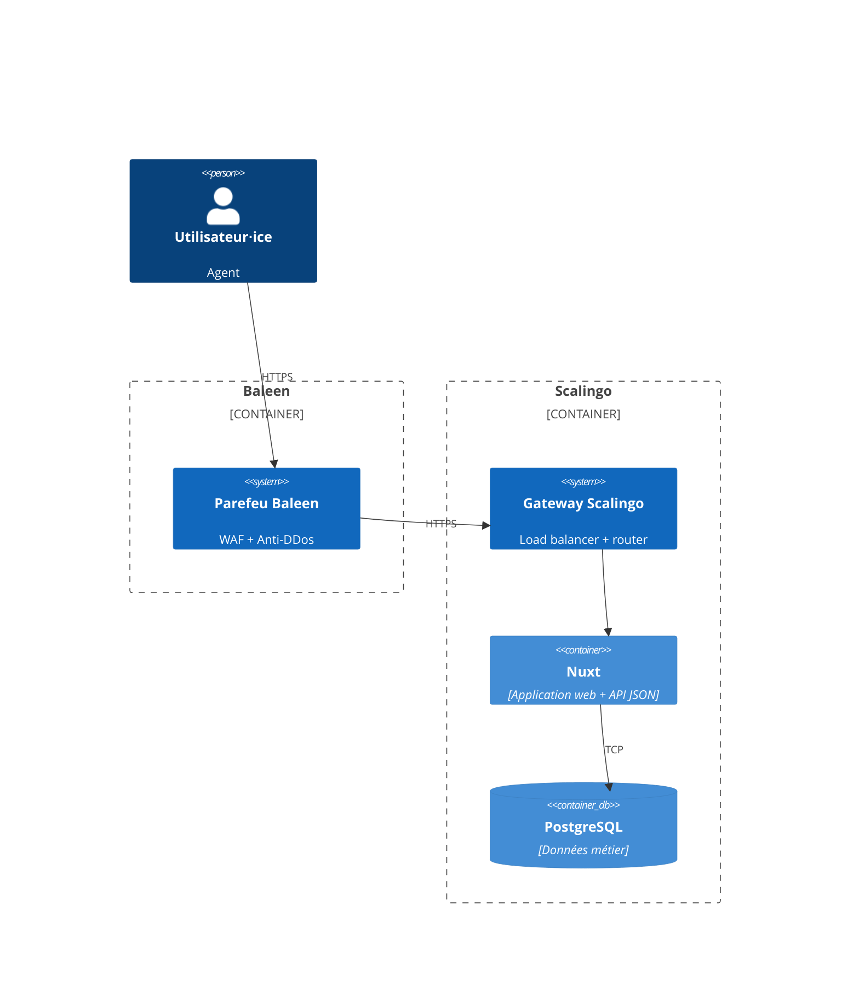
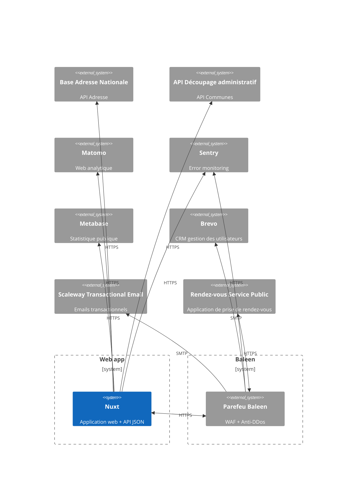
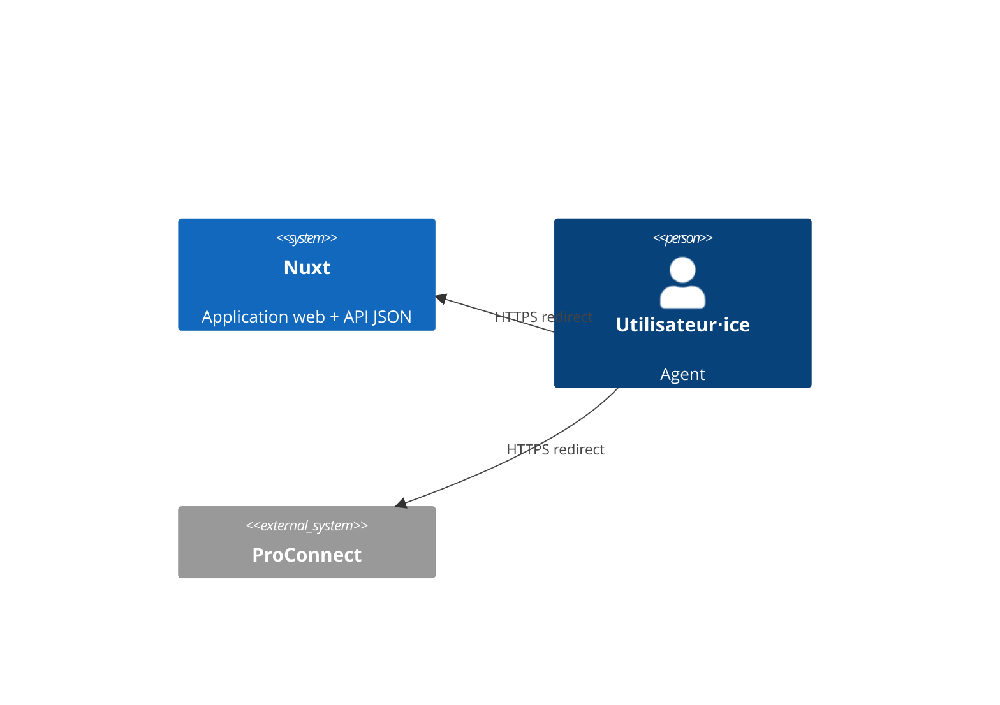
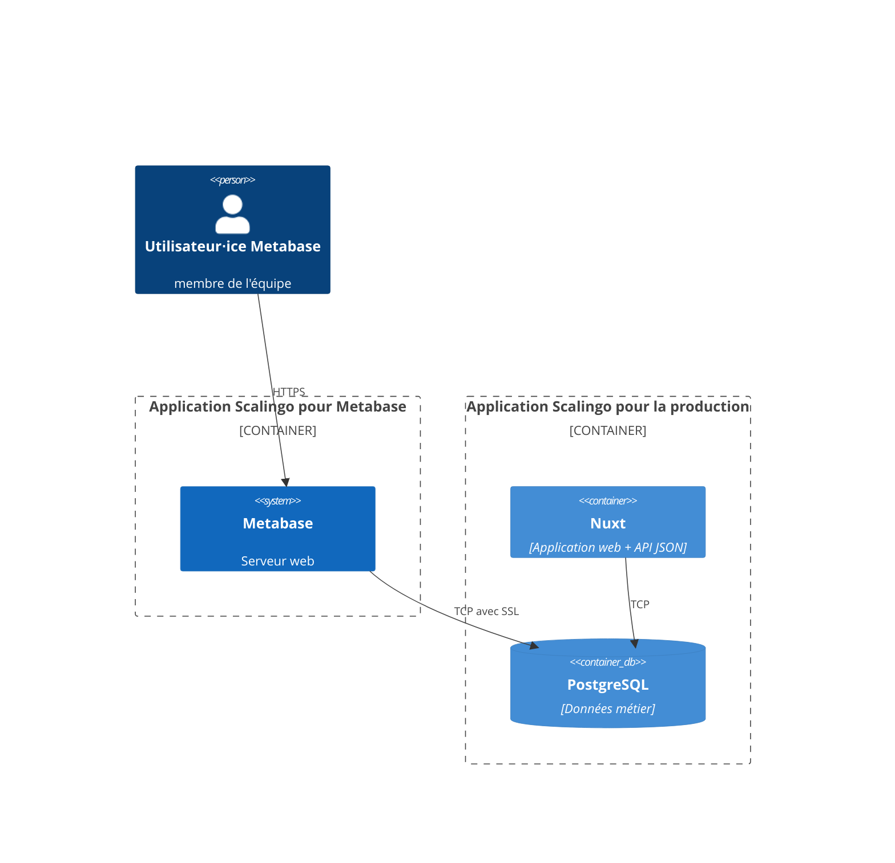

# Dossier d’architecture technique

> Ce dossier a pour but de présenter l’architecture technique du SI. Il n’est par conséquent ni un dossier
> d’installation, ni un dossier d’exploitation ou un dossier de spécifications fonctionnelles.
> Il est réalisé à partir du patron de
>
document [Dossier d'architecture technique](https://gitlab.com/groups/incubateur-territoires/startups/infrastructures-numeriques/-/wikis/Dossier-d'architecture-technique).

**Nom du projet :** Les bases du numérique d’intérêt général

**Dépôt de code :** https://github.com/inclusion-numerique/la-base

**SecNumCloud :** Non

**Hébergeur :** Scaleway, Paris (région fr-par)

**Décision d’homologation :** Non décisionnée

** Inclusion numérique :** ✅

## Suivi du document

> Le suivi de ce document est assuré par le versionnage Git.

## Fiche de contrôle

> Cette fiche a pour vocation de lister l’ensemble des acteurs du projet ainsi que leur rôle dans la rédaction de ce
> dossier.

| Organisme                  | Nom            | Rôle           | Activité  |
|----------------------------|----------------|----------------|-----------|
| Pôle inclusion numérique   | Hugues Maignol | Lead tech      | Rédaction |
| Pôle inclusion numérique   | Kevin Gallet   | Lead tech      | Relecture |
| Pôle inclusion numérique   | Manon Galle    | Intrapreneure  | Relecture |
| Incubateur des territoires | Florian Busi   | Consultant SSI | Relecture |

## Description du projet

Les bases du numérique d’intérêt général est une plateforme collaborative, ouverte à tous, et dédiées aux professionnels
de la médiation numérique, aux acteurs locaux et aux collectivités territoriales
qui souhaitent partager, recenser, ou trouver des ressources autour de l’inclusion numérique.

Il est open source, bien que les développements, l’hébergement et la maintenance soient gérés par l'équipe.

Plus d'infos sur la fiche beta : https://beta.gouv.fr/startups/les.bases.html.

## Architecture

### Stack technique

Le projet est un monoremo écrit en Typescript, avec une base Postgres pour stocker les données.

L'infrastructure est gérée par Terraform, 100% en "infrastructure as code". L'hébergement est assuré par Scaleway.

Voici les librairies utilisées qui définissent la stack technique du projet :

- [TypeScript](https://www.typescriptlang.org/) : Le langage de programmation utilisé ici, c'est un langage open source
  qui s'appuie sur JavaScript en ajoutant un typage statique.
- [React](https://react.dev/) : Bibliothèque JavaScript qui permet de créer des interfaces utilisateurs interactives et
  prévisibles.
- [React Hook Form](https://react-hook-form.com/) : Bibliothèque de construction de formulaires avec React.
- [Next.js](https://nextjs.org/) : Framework full-stack pour construire des applications web avec React.
- [Système de Design de l'État (dsfr)](https://www.systeme-de-design.gouv.fr/) : Ensemble de composants réutilisables
  répondant aux standards de l'état.
- [React dsfr](https://github.com/codegouvfr/react-dsfr) : Surcouche de compatibilité React pour le Système de Design de
  l'État
- [Remix Icon](https://remixicon.com/) : Collection d'icônes.
- [Zod](https://zod.dev/) : Validation de schéma fondé sur TypeScript.
- [tRPC](https://trpc.io/) : Intégrer des API stables en bénéficiant de l'inférence de Type de TypeScript.
- [Prisma](https://www.prisma.io/) : ORM compatible avec TypeScript.
- [mjml-react](https://github.com/Faire/mjml-react) : Écrire des templates de mails avec React
  et [mjml](https://mjml.io/)
- [NextAuth.js](https://next-auth.js.org/) : Adaptateur pour services d'authentification.
- [Eslint](https://eslint.org/) : Analyseur statique de code pour JavaScript et TypeScript.
- [Prettier](https://prettier.io/) : Formateur de code pour divers langages et syntaxes.
- [Jest](https://jestjs.io/) : Environnement d'exécution des tests unitaires.
- [Cypress](https://www.cypress.io) : Environnement d'exécution des tests de bout en bout et de tests de composants.
- [Storybook](https://storybook.js.org) : Permet de créer, documenter et tester des composants UI.
- [Sentry](https://sentry.io) : Plateforme de surveillance d'erreurs et de problèmes de performance.
- [MailDev](https://maildev.github.io/maildev/) : Serveur local et interface web pour capter les mails envoyés pendant
  le développement.

### Matrice des flux

#### Site internet

Le site internet est hébergé sur des containers applicatifs stateless Scaleway (node + nextjs), qui scalent
horizontalement en fonction de la charge.

| Source               | Destination                  | Protocole | Port | Localisation | Interne/URL Externe   |
|----------------------|------------------------------|-----------|------|--------------|-----------------------|
| Navigateur           | Container Applicatif         | HTTPS     | 443  | fr-par       | lesbases.anct.gouv.fr |
| Container Applicatif | Scaleway Postgresql          | TCP       | 5432 | fr-par       | Interne               |
| Container Applicatif | Object Storage (S3) Scaleway | HTTPS     | 443  | fr-par       | Interne               |

#### Monitoring

| Source               | Destination | Protocole | Port | Localisation  | Interne/URL Externe            |
|----------------------|-------------|-----------|------|---------------|--------------------------------|
| Navigateur           | Sentry      | HTTPS     | 443  | Tours, France | sentry.incubateur.net          |
| Container Applicatif | Sentry      | HTTPS     | 443  | Tours, France | sentry.incubateur.net          |
| Navigateur           | Matomo      | HTTPS     | 443  | Tours, France | matomo.incubateur.anct.gouv.fr |

#### Services externes

| Source             | Destination                  | Protocole       | Port | Localisation      | Interne/URL Externe               |
|--------------------|------------------------------|-----------------|------|-------------------|-----------------------------------|
| Nuxt Client        | Base Adresse Nationale       | HTTPS           | 443  | Paris, France     | https://api-adresse.data.gouv.fr  |
| Nuxt Client        | API Découpage administratif  | HTTPS           | 443  | Paris, France     | https://geo.api.gouv.fr           |
| Baleen             | RDV Service Public           | HTTPS (OAuth)   | 443  | Paris, France     | https://rdv.anct.gouv.fr/api/v1   |
| RDV Service Public | Baleen                       | HTTPS (webhook) | 443  | Paris/SecNumCloud | https://rdv.anct.gouv.fr/api/v1   |

#### Fournisseurs d'identité

| Source     | Destination | Protocole     | Port | Localisation | Interne/URL Externe       |
|------------|-------------|---------------|------|--------------|---------------------------|
| Navigateur | ProConnect  | HTTPS (OAuth) | 443  | France       | auth.agentconnect.gouv.fr |

### Inventaire des dépendances

| Nom de l’applicatif | Service    | Version | Commentaires                                                                                         |
|---------------------|------------|---------|------------------------------------------------------------------------------------------------------|
| Application web     | NextJS     | 14      | Voir ci-dessous pour le détail des librairies                                                        |
| Base de données     | PostgreSQL | 14      | Stockage des données métier, voir [/apps/web/prisma/schema.prisma](/apps/web/prisma/schema.prisma)   |
| Infrastructure as code | Terraform | 1.5   | Voir [/packages/cdk/Readme.md](/packages/cdk/Readme.md) pour plus d’informations sur le provisioning |

La liste des dépendences nodejs est disponible dans :

- [/packages.json](/packages.json) pour la liste des dépendences du monorepo
- [/apps/cli/package.json](/apps/cli/package.json) pour la liste des dépendences de l'application cli
- [/apps/web/package.json](/apps/web/package.json) pour la liste des dépendences de l'application web
- [/packages/cdk/package.json](/packages/cdk/package.json) pour la liste des dépendences du package cdk
- [/packages/config/package.json](/packages/config/package.json) pour la liste des dépendences du package config
- [/packages/e2e/package.json](/packages/e2e/package.json) pour la liste des dépendences du package e2e
- [/packages/emails/package.json](/packages/emails/package.json) pour la liste des dépendences du package emails
- [/packages/fixtures/package.json](/packages/fixtures/package.json) pour la liste des dépendences du package fixtures
- [/packages/lint/package.json](/packages/lint/package.json) pour la liste des dépendences du package lint
- [/packages/storybook/package.json](/packages/storybook/package.json) pour la liste des dépendences du package storybook
- [/packages/test/package.json](/packages/test/package.json) pour la liste des dépendences du package test
- [/packages/ui/package.json](/packages/ui/package.json) pour la liste des dépendences du package ui
- [pnpm-lock.yaml](/pnpm-lock.yaml) pour la liste complète des librairies utilisées directement et indirectement et leurs versions précises

### Schéma de l’architecture

Notre application est accessible à l'adresse: https://lesbases.anct.gouv.fr

Nous déployons des instances temporaires pour chaque pull request, qui sont détruites au moment du merge.
Ces instances de validations suivent le format d’url suivant : https://<nom-de-la-branche-git>
.v2.labase.incubateur.anct.gouv.fr

```mermaid
flowchart TD
    %% Domaines de prod
    lesbases.anct.gouv.fr

    %% Domaines de dev
    dev.v2.labase.incubateur.anct.gouv.fr
    <nom-de-la-branche-git>.v2.labase.incubateur.anct.gouv.fr

```

#### Architecture interne à Scalingo



#### Échanges entre l'app et les services externes



#### Échanges entre l'app, les fournisseurs d'identités, et les utilisateur⋅ices



#### Échanges entre l'app et Metabase

Notre équipe utilise Metabase pour réaliser des statistiques afin de suivre l'utilisation de l'application et produire
les statistiques publiques accessibles à
l'adresse [https://monsuivisocial.incubateur.anct.gouv.fr/statistiques](https://monsuivisocial.incubateur.anct.gouv.fr/statistiques).

Un utilisateur postgresql aux droits restreints en lecture seule est utilisé pour la connexion à la base de données
depuis Metabase.



### Gestion DNS

C'est **Gandi (gandi.net)** qui fournit nos noms de domaine et la gestion DNS.

Nous y gérons les domaines suivants exploités :

- `monsuivisocial.incubateur.anct.gouv.fr` : domaine de production
- `monsuivisocial-demo.dev.incubateur.anct.gouv.fr` : domaine de démonstration
- `monsuivisocial.dev.incubateur.anct.gouv.fr` : domaine de developpement
- `metabase.monsuivisocial.incubateur.anct.gouv.fr/` : domaine de l'application de Business Intelligence Metabase

et les domaines suivants qui seront destinés à l'application une fois que le site vitrine sera migré vers
sites-faciles :

- `monsuivisocial-app.incubateur.anct.gouv.fr` : application de production
- `monsuivisocial-app-demo.dev.incubateur.anct.gouv.fr` : application de démonstration
- `monsuivisocial-app.dev.incubateur.anct.gouv.fr` : application de developpement

### Schéma des données

Voir [/apps/web/prisma/schema.prisma](/apps/web/prisma/schema.prisma) pour la liste des tables et des champs.

A la date du 2025-04-17, voici le schéma des données :

```mermaid
classDiagram
direction BT
class _prisma_migrations {
   varchar(64) checksum
   timestamp with time zone finished_at
   varchar(255) migration_name
   text logs
   timestamp with time zone rolled_back_at
   timestamp with time zone started_at
   integer applied_steps_count
   varchar(36) id
}
class accounts {
   uuid user_id
   text type
   text provider
   text provider_account_id
   text refresh_token
   text access_token
   integer expires_at
   text token_type
   text scope
   text id_token
   text session_state
   text id
}
class base_follows {
   integer legacy_id
   uuid base_id
   uuid follower_id
   timestamp(3) followed
   uuid id
}
class base_members {
   uuid member_id
   uuid base_id
   boolean is_admin
   timestamp(3) accepted
   text acceptation_token
   integer legacy_id
   timestamp(3) added
   uuid id
}
class bases {
   integer legacy_id
   text title
   uuid image_id
   text slug
   text title_duplication_check_slug
   text description
   uuid created_by_id
   boolean is_public
   timestamp(3) created
   timestamp(3) updated
   text base
   text department
   text email
   boolean email_is_public
   text facebook
   text linkedin
   text twitter
   text website
   timestamp(3) deleted
   uuid cover_image_id
   text excerpt
   uuid id
}
class collection_resources {
   integer legacy_id
   uuid resource_id
   uuid collection_id
   timestamp(3) added
   integer legacy_pinned_resources_id
   integer order
   uuid id
}
class collections {
   text title
   text description
   boolean is_public
   timestamp(3) created
   timestamp(3) deleted
   uuid created_by_id
   uuid base_id
   uuid image_id
   boolean is_favorites
   integer legacy_id
   timestamp(3) updated
   integer legacy_pinned_resources_base_id
   text slug
   integer order
   uuid id
}
class contents {
   integer legacy_content_id
   integer legacy_section_id
   integer legacy_linked_resource_id
   integer order
   uuid resource_id
   content_type type
   text title
   text caption
   uuid image_id
   text file_key
   boolean show_preview
   text url
   text linkDescription
   text linkTitle
   text linkImageUrl
   text linkFaviconUrl
   text text
   timestamp(3) created
   timestamp(3) updated
   text image_alt_text
   uuid id
}
class feedback {
   uuid sent_by_id
   integer rating
   boolean had_difficulty
   difficulty_area difficulty_area
   text difficulty_comment
   text comment
   text wants_to_be_contacted
   timestamp(3) created
   uuid id
}
class images {
   integer legacy_id
   text alt_text
   text blur_url
   integer original_height
   integer original_width
   double precision crop_height
   double precision crop_width
   double precision crop_top
   double precision crop_left
   integer height
   integer width
   text upload_key
   uuid id
}
class job_executions {
   text name
   timestamp(3) started
   timestamp(3) completed
   timestamp(3) errored
   integer duration
   jsonb data
   jsonb result
   text error
   uuid id
}
class profile_follows {
   integer legacy_id
   uuid profile_id
   uuid follower_id
   timestamp(3) followed
   uuid id
}
class resource_contributors {
   uuid contributor_id
   uuid resource_id
   timestamp(3) added
   integer legacy_id
   uuid id
}
class resource_events {
   resource_event_type type
   jsonb data
   timestamp(3) timestamp
   integer sequence
   uuid resource_id
   uuid by_id
   uuid id
}
class resource_feedback {
   integer rating
   text comment
   timestamp(3) created
   timestamp(3) updated
   timestamp(3) deleted
   uuid sent_by_id
   uuid resource_id
}
class resource_reports {
   uuid resource_id
   uuid sent_by_id
   resource_report_reason reason
   timestamp(3) created
   text comment
   uuid id
}
class resource_views {
   text hash
   integer legacy_id
   uuid resource_id
   uuid user_id
   timestamp(3) timestamp
   uuid id
}
class resources {
   integer legacy_id
   text title
   text slug
   text title_duplication_check_slug
   boolean is_public
   uuid image_id
   text description
   uuid created_by_id
   timestamp(3) published
   uuid base_id
   timestamp(3) created
   timestamp(3) updated
   timestamp(3) deleted
   theme[] themes
   support_type[] support_types
   target_audience[] target_audiences
   text excerpt
   timestamp(3) last_published
   boolean publicFeedback
   timestamp(3) last_view
   integer views_count
   uuid id
}
class saved_collection {
   integer legacy_id
   uuid saved_by_id
   uuid collection_id
   uuid base_id
   timestamp(3) saved
   uuid id
}
class search_executions {
   uuid user_id
   text query
   timestamp(3) timestamp
   integer duration
   integer results
   theme[] themes
   support_type[] support_types
   target_audience[] target_audiences
   text[] departments
   integer page
   integer per_page
   text sorting
   search_type type
   uuid id
}
class sessions {
   text session_token
   uuid user_id
   timestamp(3) expires
   uuid usurper_id
   uuid id
}
class uploads {
   text legacy_key
   text mime_type
   text name
   integer size
   uuid uploaded_by_id
   timestamp(3) created
   text key
}
class user_email_reconciliation {
   text old_email
   text expected_new_email
}
class users {
   integer legacy_id
   text first_name
   text last_name
   text name
   text email
   timestamp(3) email_verified
   uuid image_id
   text location
   text title
   text description
   boolean is_public
   timestamp(3) created
   timestamp(3) updated
   timestamp(3) deleted
   text department
   text slug
   boolean email_is_public
   text facebook
   text linkedin
   text twitter
   text website
   timestamp(3) has_seen_v2_onboarding
   user_role role
   timestamp(3) last_login
   boolean is_fixture
   text timezone
   uuid id
}
class verification_tokens {
   text identifier
   timestamp(3) expires
   text token
}

accounts  -->  users : user_id:id
base_follows  -->  bases : base_id:id
base_follows  -->  users : follower_id:id
base_members  -->  bases : base_id:id
base_members  -->  users : member_id:id
bases  -->  images : cover_image_id:id
bases  -->  images : image_id:id
bases  -->  users : created_by_id:id
collection_resources  -->  collections : collection_id:id
collection_resources  -->  resources : resource_id:id
collections  -->  bases : base_id:id
collections  -->  images : image_id:id
collections  -->  users : created_by_id:id
contents  -->  images : image_id:id
contents  -->  resources : resource_id:id
contents  -->  uploads : file_key:key
feedback  -->  users : sent_by_id:id
images  -->  uploads : upload_key:key
profile_follows  -->  users : profile_id:id
profile_follows  -->  users : follower_id:id
resource_contributors  -->  resources : resource_id:id
resource_contributors  -->  users : contributor_id:id
resource_events  -->  resources : resource_id:id
resource_events  -->  users : by_id:id
resource_feedback  -->  resources : resource_id:id
resource_feedback  -->  users : sent_by_id:id
resource_reports  -->  resources : resource_id:id
resource_reports  -->  users : sent_by_id:id
resource_views  -->  resources : resource_id:id
resource_views  -->  users : user_id:id
resources  -->  bases : base_id:id
resources  -->  images : image_id:id
resources  -->  users : created_by_id:id
saved_collection  -->  bases : base_id:id
saved_collection  -->  collections : collection_id:id
saved_collection  -->  users : saved_by_id:id
search_executions  -->  users : user_id:id
sessions  -->  users : user_id:id
sessions  -->  users : usurper_id:id
uploads  -->  users : uploaded_by_id:id
users  -->  images : image_id:id


```

Le dernier fichier commité est [docs/database-model.svg](docs/database-model.svg)

## Exigences générales

### Accès aux serveurs et sécurité des échanges

Les serveurs (applicatif et base de données) sont gérés par Scalingo. Scalingo ne fournit pas de système de rôle : soit
on a accès à une app, soit on ne l'a pas.

Nous avons actuellement 4 apps Scalingo déployées :

- `osc-secnum-fr1/anct-monsuivisocial-prod`
- `osc-secnum-fr1/anct-monsuivisocial-metabase-prod`
- `osc-fr1/anct-monsuivisocial-demo`
- `osc-fr1/anct-monsuivisocial-dev`

et 3 apps Scalingo en cours de déploiement pour gérer le site web à venir grâce à sites-faciles :

- `osc-fr1/anct-monsuivisocial-website-dev`
- `osc-fr1/anct-monsuivisocial-website-demo`
- `osc-secnum-fr1/anct-monsuivisocial-website-prod`

Le fait d'avoir accès à une app Scalingo donne les droits suivants :

- augmenter ou réduire le nombre d'instances applicatives de l'app / régler les paramètres d'autoscaling
- administrer la base Postgres (changer la taille de l'instance, mettre à jour Postgres, télécharger des backups, etc)
- administrer la base Redis (même fonctionnalités que pour Postgres ci-dessus)
- visualiser les déploiements passés ou en cours
- configurer le déploiement automatique d'une branche GitHub
- visualiser l'activité de l'app (scaling, déploiements, commandes lancées en one-off)
- visualiser les logs (app + jobs + routeur Scalingo) et en télécharger des archives
- visualiser des metrics (requêtes par minute, temps de réponse, CPU, RAM)
- lire et modifier les variables d'environnements
- octroyer aux équipes support Scalingo le droit d'accéder à l'environnement d'exécution de l'application et aux
  métadonnées et aux données de surveillance des bases de données
- ajouter ou supprimer des collaborateurs sur l'app
- ajouter au supprimer les domaines autorisés à pointer vers l'app
- gérer les alertes

Les accès Scalingo sont octroyés uniquement à l'équipe technique ("devs") car iels en ont besoin de tout ou une partie
des fonctionnalités listées afin de :

- surveiller la santé de l'app de production
- lancer une console distante en production afin d'investiguer des bugs
- ajouter ou mettre à jour des variables d'environnement
- vérifier le bon déploiement des nouvelles versions du code

Scalingo propose du 2FA par TOTP, mais aucun mécanisme ne force les collaborateurs à l'activer. Nous avons donc dans
notre checklist d'onboarding un point précisant qu'il faut impérativement activer le 2FA. En cas de perte des codes
TOTP, Scalingo propose une procédure qui inclut la vérification de l'identité de l'utilisateur concerné par la
transmission d'un document d'identité.

#### Détection de fuite de secrets

Nous avons un job de détection de secret `GitLab secrets analyzer v6.0.0` configuré dans Gitlab Ci/CD. Ce système envoie
des alertes et bloque le push si des secrets sont détectés dans un commit.

En local, un hook de precommit utilisant la bibliothèque [talisman](https://thoughtworks.github.io/talisman/), scanne le
code produit pour détecter d'éventuelles fuites de secret et empêcher en amont leur introduction dans du code déployé.

### Authentification, contrôle d’accès, habilitations et profils

L'application a 6 types d'utilisateurs :

- Responsable de structure
- Travailleur social
- Instructeur
- Agent d'accueil/CNFS
- Référent
- Administrateur

Les comptes utilisateurs ont une contrainte d'unicité sur les emails.

Les sessions sont déconnectées automatiquement en cas d'inactivité de l'utilisateur. On considère un utilisateur inactif
lorsque la souris est immobile.

#### Les agents

Les agents (ce rôle concerne touts les types d'utilisateurs sauf les administrateurs) ont accès à diverses
fonctionnalités touchants à :

- l'accès à la liste des bénéficiaires
- l'accès à la fiche d'un bénéficiaire
- l'accès aux demandes d'aide d'un bénéficiaire
- l'accès aux synthèses d'entretien d'un bénéficiaire
- l'accès aux rendez-vous d'un bénéficiaire
- l'accès au budget d'un bénéficiaire
- la gestion des autres utilisateurs de leur structure
- l'ajout de documents dans une fiche bénéficiaire
- l'export des données des bénéficiaires
- l'export des statistiques

Les règles d'accès à ces ressources sont complexes et dépendent de plusieurs niveaux d'accès attribués aux agents.

Ces règles d'accès sont directements gérées par l'application.

La connexion à un profil agent est faite par ProConnect.

#### Les administrateurs

Une interface CRUD permettant de gérer l'ensemble des structures et
utilisateurs est proposée en interne à l'équipe.

Afin de s'y connecter, il faut utiliser se rendre sur la page
`https://monsuivisocial.incubateur.anct.gouv.fr/auth/admin`. Un système de lien magique envoyé par mail permet d'y
accéder.

### Traçabilité des erreurs et des actions utilisateurs

#### Logs textuels

Les logs textuels sont écrits dans le système de log de Scalingo. Cela comprend :

- Les logs des commandes de la production (e.g. lancer la console)
- les changements de variables d'environnements

Les logs produits par le routeur de Scalingo contiennent, pour chaque requêtes HTTP :

- timestamp
- path HTTP
- méthode HTTP
- IP d'origine
- referer
- user agent

La consultation des logs textuels ne se fait que lors d'investigations de bugs. Leur usage est donc uniquement ponctuel
et leur consultation est manuelle. Nous n'avons pas de système d'analyse de logs.

#### Traçabilité applicative / auditing

Un mécanisme interne à l'application permet de stocker en base de données les actions des utilisateurs. Ces actions sont
stockées dans la table `user_activity`.

Toutes les actions ne sont pas tracées. Seuls les actions de création, suppression et modification le sont. A noter que
le contenu de chaque modification de données est stocké de manière incrémentale dans cette table.

#### Monitoring d'erreur

Nous utilisons Sentry afin d'être informé⋅es sur les nouvelles erreurs, et le volume des erreurs existantes.
Nous utilisons l'instance Sentry de l'incubateur beta.gouv (sentry.incubateur.net).

Notre hébergeur Scalingo propose aussi un système d'alerting déclenché selon des métriques diverses, mais
celui-ci n'est pas utilisé actuellement car sa calibration est difficile.

### Intégrité

Des backups de nos bases de données Postgres sont faîtes automatiquement par Scalingo. Ces backups sont
créés quotidiennement. La politique de retention des backups est la suivante:

- Backups journaliers conservés : 7 jours
- Backups hebdomadaires conservés : 8 semaines
- Backups mensuels conservés : 12 mois

Scalingo nous offre également la fonctionnalité de Point-in-time Recovery. Nous profitons également d'un système
de cluster avec 2 nodes, qui permet un failover automatique en cas de plantage d'une instance Postgres.

### Confidentialité

**L'application est conçue pour le suivi des bénéficiaires des CCAS. Nous manipulons donc des données sensibles.**

Parmi les données que nous manipulons, les plus critiques sont :

- les coordonnées des bénéficiaires
- l'historique des synthèses des entretiens
- l'historique des demandes d'aide
- des documents personnels du bénéficiaire
