# Dossier d’architecture technique

> Ce dossier a pour but de présenter l’architecture technique du SI. Il n’est par conséquent ni un dossier
> d’installation, ni un dossier d’exploitation ou un dossier de spécifications fonctionnelles.
> Il est réalisé à partir du patron de
> [Dossier d'architecture technique](https://gitlab.com/groups/incubateur-territoires/startups/infrastructures-numeriques/-/wikis/Dossier-d'architecture-technique).

**Nom du projet :** Les bases du numérique d’intérêt général

**Dépôt de code :** https://github.com/inclusion-numerique/la-base

**SecNumCloud :** Non

**Hébergeur :** Scaleway, Paris (région fr-par)

**Décision d’homologation :** Non décisionnée

**Inclusion numérique :** ✅

## Suivi du document

> Le suivi de ce document est assuré par le versionnage Git.

## Fiche de contrôle

> Cette fiche a pour vocation de lister l’ensemble des acteurs du projet ainsi que leur rôle dans la rédaction de ce
> dossier.

| Organisme                  | Nom            | Rôle           | Activité  |
|----------------------------|----------------|----------------|-----------|
| Pôle inclusion numérique   | Hugues Maignol | Lead tech      | Rédaction |
| Pôle inclusion numérique   | Kevin Gallet   | Lead tech      | Relecture |
| Pôle inclusion numérique   | Manon Galle    | Intrapreneure  | Relecture |
| Incubateur des territoires | Florian Busi   | Consultant SSI | Relecture |

## Description du projet

Les bases du numérique d’intérêt général est une plateforme collaborative, ouverte à tous, et dédiées aux professionnels
de la médiation numérique, aux acteurs locaux et aux collectivités territoriales
qui souhaitent partager, recenser, ou trouver des ressources autour de l’inclusion numérique.

Il est open source, bien que les développements, l’hébergement et la maintenance soient gérés par l'équipe.

Plus d'infos sur la fiche beta : https://beta.gouv.fr/startups/les.bases.html.

## Architecture

### Stack technique

Le projet est un monorepo écrit en Typescript, avec une base Postgres pour stocker les données.

L'infrastructure est gérée par Terraform, 100% en "infrastructure as code". L'hébergement est assuré par Scaleway.

Voici les librairies utilisées qui définissent la stack technique du projet :

- [TypeScript](https://www.typescriptlang.org/) : Le langage de programmation utilisé ici, c'est un langage open source
  qui s'appuie sur JavaScript en ajoutant un typage statique.
- [React](https://react.dev/) : Bibliothèque JavaScript qui permet de créer des interfaces utilisateurs interactives et
  prévisibles.
- [React Hook Form](https://react-hook-form.com/) : Bibliothèque de construction de formulaires avec React.
- [Next.js](https://nextjs.org/) : Framework full-stack pour construire des applications web avec React.
- [Système de Design de l'État (dsfr)](https://www.systeme-de-design.gouv.fr/) : Ensemble de composants réutilisables
  répondant aux standards de l'état.
- [React dsfr](https://github.com/codegouvfr/react-dsfr) : Surcouche de compatibilité React pour le Système de Design de
  l'État
- [Remix Icon](https://remixicon.com/) : Collection d'icônes.
- [Zod](https://zod.dev/) : Validation de schéma fondé sur TypeScript.
- [tRPC](https://trpc.io/) : Intégrer des API stables en bénéficiant de l'inférence de Type de TypeScript.
- [Prisma](https://www.prisma.io/) : ORM compatible avec TypeScript.
- [mjml-react](https://github.com/Faire/mjml-react) : Écrire des templates de mails avec React
  et [mjml](https://mjml.io/)
- [NextAuth.js](https://next-auth.js.org/) : Adaptateur pour services d'authentification.
- [Biome](https://biomejs.dev/) : Formatteur et linteur pour JavaScript, CSS et TypeScript.
- [Prettier](https://prettier.io/) : Formateur de code pour divers langages et syntaxes.
- [Jest](https://jestjs.io/) : Environnement d'exécution des tests unitaires.
- [Cypress](https://www.cypress.io) : Environnement d'exécution des tests de bout en bout et de tests de composants.
- [Storybook](https://storybook.js.org) : Permet de créer, documenter et tester des composants UI.
- [Sentry](https://sentry.io) : Plateforme de surveillance d'erreurs et de problèmes de performance.
- [MailDev](https://maildev.github.io/maildev/) : Serveur local et interface web pour capter les mails envoyés pendant
  le développement.

### Matrice des flux

#### Site internet

Le site internet est hébergé sur des containers applicatifs stateless Scaleway (node + next.js), qui scalent
horizontalement en fonction de la charge.

| Source               | Destination                  | Protocole | Port | Localisation | Interne/URL Externe                                                  |
|----------------------|------------------------------|-----------|------|--------------|----------------------------------------------------------------------|
| Navigateur           | Container Applicatif         | HTTPS     | 443  | fr-par       | lesbases.anct.gouv.fr                                                |
| Container Applicatif | Scaleway Postgresql          | TCP       | 5432 | fr-par       | Interne                                                              |
| Navigateur           | Object Storage (S3) Scaleway | HTTPS     | 443  | fr-par       | s3.fr-par.scw.cloud                                                  |
| Container Applicatif | Object Storage (S3) Scaleway | HTTPS     | 443  | fr-par       | Interne                                                              |
| Container Applicatif | Internet                     | HTTPS     | 443  | Monde        | récupération des données open graph des liens référencés sur le site |

#### Monitoring

| Source               | Destination | Protocole | Port | Localisation  | Interne/URL Externe            |
|----------------------|-------------|-----------|------|---------------|--------------------------------|
| Navigateur           | Sentry      | HTTPS     | 443  | Tours, France | sentry.incubateur.net          |
| Container Applicatif | Sentry      | HTTPS     | 443  | Tours, France | sentry.incubateur.net          |
| Navigateur           | Matomo      | HTTPS     | 443  | Tours, France | matomo.incubateur.anct.gouv.fr |

#### Services externes

| Source               | Destination                             | Protocole | Port | Localisation  | Interne/URL Externe |
|----------------------|-----------------------------------------|-----------|------|---------------|---------------------|
| Container Applicatif | Brevo (liste de contacts pour emailing) | HTTPS     | 443  | Paris, France | api.brevo.com       |
| Container Applicatif | Emails transactionnels Scaleway         | HTTPS     | 587  | Paris, France | smtp.tem.scw.cloud  |

#### Fournisseurs d'identité

| Source               | Destination | Protocole     | Port | Localisation | Interne/URL Externe       |
|----------------------|-------------|---------------|------|--------------|---------------------------|
| Navigateur           | ProConnect  | HTTPS (OAuth) | 443  | France       | auth.agentconnect.gouv.fr |
| Container Applicatif | ProConnect  | HTTPS (OAuth) | 443  | France       | auth.agentconnect.gouv.fr |

### Inventaire des dépendances

| Nom de l’applicatif    | Service    | Version | Commentaires                                                                                         |
|------------------------|------------|---------|------------------------------------------------------------------------------------------------------|
| Application web        | Next.js    | 14      | Voir ci-dessous pour le détail des librairies                                                        |
| Base de données        | PostgreSQL | 14      | Stockage des données métier, voir [/apps/web/prisma/schema.prisma](/apps/web/prisma/schema.prisma)   |
| Infrastructure as code | Terraform  | 1.5     | Voir [/packages/cdk/Readme.md](/packages/cdk/Readme.md) pour plus d’informations sur le provisioning |

La liste des dépendences nodejs est disponible dans :

- [/packages.json](/packages.json) pour la liste des dépendences du monorepo
- [/apps/cli/package.json](/apps/cli/package.json) pour la liste des dépendences de l'application cli
- [/apps/web/package.json](/apps/web/package.json) pour la liste des dépendences de l'application web
- [/packages/cdk/package.json](/packages/cdk/package.json) pour la liste des dépendences du package cdk
- [/packages/config/package.json](/packages/config/package.json) pour la liste des dépendences du package config
- [/packages/e2e/package.json](/packages/e2e/package.json) pour la liste des dépendences du package e2e
- [/packages/emails/package.json](/packages/emails/package.json) pour la liste des dépendences du package emails
- [/packages/fixtures/package.json](/packages/fixtures/package.json) pour la liste des dépendences du package fixtures
- [/packages/lint/package.json](/packages/lint/package.json) pour la liste des dépendences du package lint
- [/packages/storybook/package.json](/packages/storybook/package.json) pour la liste des dépendences du package
  storybook
- [/packages/test/package.json](/packages/test/package.json) pour la liste des dépendences du package test
- [/packages/ui/package.json](/packages/ui/package.json) pour la liste des dépendences du package ui
- [pnpm-lock.yaml](/pnpm-lock.yaml) pour la liste complète des librairies utilisées directement et indirectement et
  leurs versions précises

### Politique de mise à jour de l’application et des dépendances

#### Mises à jour de sécurité

Nous suivons les rapports de vulnérabilités sur les composants listés ci-dessus. Dependabot est utilisé pour surveiller
les vulnérabilités et les mises à jour de versions disponibles.

#### Mises à jour des librairies

Nous suivons les mises à jour des versions des librairies et les intégrons au fil de l’eau et adaptons le code applicatif pour utiliser les versions les plus stables et récentes disponibles et faciliter la maintenance.

#### Mises à jour fonctionnelles

Les mises à jour fonctionnelles sont effectuées en fonction de la roadmap et sont déployées en production régulièrement (environ une fois par semaine), après des tests unitaires, d'integration, et end-to-end pour s'assurer au maximum des non-régressions.

### Schéma de l’architecture

Notre application est accessible à l'adresse: https://lesbases.anct.gouv.fr

Nous déployons des instances temporaires pour chaque pull request, qui sont détruites au moment du merge.
Ces instances de validations suivent le format d’url suivant : https://<nom-de-la-branche-git>
.v2.labase.incubateur.anct.gouv.fr

### Gestion DNS

La zone DNS lesbases.anct.gouv.fr a été configurée par le SI de l’ANCT pour être gérée par Scaleway.

Les entrées DNS sont gérées par terraform comme les autres ressources de l'infrastructure.

### Schéma des données

Voir [/apps/web/prisma/schema.prisma](/apps/web/prisma/schema.prisma) pour la liste des tables et des champs.

A la date du 2025-04-17, voici le schéma des données :

```mermaid
classDiagram
  direction BT
  class _prisma_migrations {
    varchar(64) checksum
    timestamp with time zone finished_at
    varchar(255) migration_name
    text logs
    timestamp with time zone rolled_back_at
    timestamp with time zone started_at
    integer applied_steps_count
    varchar(36) id
  }
  class accounts {
    uuid user_id
    text type
    text provider
    text provider_account_id
    text refresh_token
    text access_token
    integer expires_at
    text token_type
    text scope
    text id_token
    text session_state
    text id
  }
  class base_follows {
    integer legacy_id
    uuid base_id
    uuid follower_id
    timestamp(3) followed
    uuid id
  }
  class base_members {
    uuid member_id
    uuid base_id
    boolean is_admin
    timestamp(3) accepted
    text acceptation_token
    integer legacy_id
    timestamp(3) added
    uuid id
  }
  class bases {
    integer legacy_id
    text title
    uuid image_id
    text slug
    text title_duplication_check_slug
    text description
    uuid created_by_id
    boolean is_public
    timestamp(3) created
    timestamp(3) updated
    text base
    text department
    text email
    boolean email_is_public
    text facebook
    text linkedin
    text twitter
    text website
    timestamp(3) deleted
    uuid cover_image_id
    text excerpt
    uuid id
  }
  class collection_resources {
    integer legacy_id
    uuid resource_id
    uuid collection_id
    timestamp(3) added
    integer legacy_pinned_resources_id
    integer order
    uuid id
  }
  class collections {
    text title
    text description
    boolean is_public
    timestamp(3) created
    timestamp(3) deleted
    uuid created_by_id
    uuid base_id
    uuid image_id
    boolean is_favorites
    integer legacy_id
    timestamp(3) updated
    integer legacy_pinned_resources_base_id
    text slug
    integer order
    uuid id
  }
  class contents {
    integer legacy_content_id
    integer legacy_section_id
    integer legacy_linked_resource_id
    integer order
    uuid resource_id
    content_type type
    text title
    text caption
    uuid image_id
    text file_key
    boolean show_preview
    text url
    text linkDescription
    text linkTitle
    text linkImageUrl
    text linkFaviconUrl
    text text
    timestamp(3) created
    timestamp(3) updated
    text image_alt_text
    uuid id
  }
  class feedback {
    uuid sent_by_id
    integer rating
    boolean had_difficulty
    difficulty_area difficulty_area
    text difficulty_comment
    text comment
    text wants_to_be_contacted
    timestamp(3) created
    uuid id
  }
  class images {
    integer legacy_id
    text alt_text
    text blur_url
    integer original_height
    integer original_width
    double precision crop_height
    double precision crop_width
    double precision crop_top
    double precision crop_left
    integer height
    integer width
    text upload_key
    uuid id
  }
  class job_executions {
    text name
    timestamp(3) started
    timestamp(3) completed
    timestamp(3) errored
    integer duration
    jsonb data
    jsonb result
    text error
    uuid id
  }
  class profile_follows {
    integer legacy_id
    uuid profile_id
    uuid follower_id
    timestamp(3) followed
    uuid id
  }
  class resource_contributors {
    uuid contributor_id
    uuid resource_id
    timestamp(3) added
    integer legacy_id
    uuid id
  }
  class resource_events {
    resource_event_type type
    jsonb data
    timestamp(3) timestamp
    integer sequence
    uuid resource_id
    uuid by_id
    uuid id
  }
  class resource_feedback {
    integer rating
    text comment
    timestamp(3) created
    timestamp(3) updated
    timestamp(3) deleted
    uuid sent_by_id
    uuid resource_id
  }
  class resource_reports {
    uuid resource_id
    uuid sent_by_id
    resource_report_reason reason
    timestamp(3) created
    text comment
    uuid id
  }
  class resource_views {
    text hash
    integer legacy_id
    uuid resource_id
    uuid user_id
    timestamp(3) timestamp
    uuid id
  }
  class resources {
    integer legacy_id
    text title
    text slug
    text title_duplication_check_slug
    boolean is_public
    uuid image_id
    text description
    uuid created_by_id
    timestamp(3) published
    uuid base_id
    timestamp(3) created
    timestamp(3) updated
    timestamp(3) deleted
    theme[] themes
    support_type[] support_types
    target_audience[] target_audiences
    text excerpt
    timestamp(3) last_published
    boolean publicFeedback
    timestamp(3) last_view
    integer views_count
    uuid id
  }
  class saved_collection {
    integer legacy_id
    uuid saved_by_id
    uuid collection_id
    uuid base_id
    timestamp(3) saved
    uuid id
  }
  class search_executions {
    uuid user_id
    text query
    timestamp(3) timestamp
    integer duration
    integer results
    theme[] themes
    support_type[] support_types
    target_audience[] target_audiences
    text[] departments
    integer page
    integer per_page
    text sorting
    search_type type
    uuid id
  }
  class sessions {
    text session_token
    uuid user_id
    timestamp(3) expires
    uuid usurper_id
    uuid id
  }
  class uploads {
    text legacy_key
    text mime_type
    text name
    integer size
    uuid uploaded_by_id
    timestamp(3) created
    text key
  }
  class user_email_reconciliation {
    text old_email
    text expected_new_email
  }
  class users {
    integer legacy_id
    text first_name
    text last_name
    text name
    text email
    timestamp(3) email_verified
    uuid image_id
    text location
    text title
    text description
    boolean is_public
    timestamp(3) created
    timestamp(3) updated
    timestamp(3) deleted
    text department
    text slug
    boolean email_is_public
    text facebook
    text linkedin
    text twitter
    text website
    timestamp(3) has_seen_v2_onboarding
    user_role role
    timestamp(3) last_login
    boolean is_fixture
    text timezone
    uuid id
  }
  class verification_tokens {
    text identifier
    timestamp(3) expires
    text token
  }

  accounts --> users: user_id to id
  base_follows --> bases: base_id to id
  base_follows --> users: follower_id to id
  base_members --> bases: base_id to id
  base_members --> users: member_id to id
  bases --> images: cover_image_id to id
  bases --> images: image_id to id
  bases --> users: created_by_id to id
  collection_resources --> collections: collection_id to id
  collection_resources --> resources: resource_id to id
  collections --> bases: base_id to id
  collections --> images: image_id to id
  collections --> users: created_by_id to id
  contents --> images: image_id to id
  contents --> resources: resource_id to id
  contents --> uploads: file_key to key
  feedback --> users: sent_by_id to id
  images --> uploads: upload_key to key
  profile_follows --> users: profile_id to id
  profile_follows --> users: follower_id to id
  resource_contributors --> resources: resource_id to id
  resource_contributors --> users: contributor_id to id
  resource_events --> resources: resource_id to id
  resource_events --> users: by_id to id
  resource_feedback --> resources: resource_id to id
  resource_feedback --> users: sent_by_id to id
  resource_reports --> resources: resource_id to id
  resource_reports --> users: sent_by_id to id
  resource_views --> resources: resource_id to id
  resource_views --> users: user_id to id
  resources --> bases: base_id to id
  resources --> images: image_id to id
  resources --> users: created_by_id to id
  saved_collection --> bases: base_id to id
  saved_collection --> collections: collection_id to id
  saved_collection --> users: saved_by_id to id
  search_executions --> users: user_id to id
  sessions --> users: user_id to id
  sessions --> users: usurper_id to id
  uploads --> users: uploaded_by_id to id
  users --> images: image_id to id


```

## Exigences générales

### Accès aux serveurs et sécurité des échanges

Les serveurs (applicatif et base de données) sont gérés par Scaleway dans l’organisation de l’incubateur des
territoires, dans le projet "la base".
L'équipe transverse de l’Incubateur des Territoires administre les droits d’accès via le système "IAM" utilisé par
Scaleway.

Les accès Scalingo sont octroyés uniquement à l'équipe technique (Développeurs et Product manager) pour :

- surveiller la santé de l'app de production (logs et metrics)
- ajouter ou mettre à jour des secrets
- executer des opérations manuelles sur les services Scaleway en cas de panne

Scaleway propose du 2FA par TOTP, et tous les membres de l’équipe se doivent de l’activer.

Les secrets sont gérés par le service Secret Manager de Scaleway.

#### Détection de fuite de secrets et de vulnérabilités

Nous avons activé des services Github pour la detection de vulnérabilités et de fuites de secrets.

- Privae vulnerability reporting
- Dependabot alerts
- Dependabot security updates
- CodeQL analysis
- Secret Protection

### Authentification, contrôle d’accès, habilitations et profils

L'application a 3 rôles pour les utilisateurs :

- Utilisateurs
- Administrateurs
- Support

Les rôle Administrateur et Support ont accès à un backoffice pour gérer les utilisateurs et données du
site.

### Traçabilité des erreurs et des actions utilisateurs

#### Logs textuels

Les logs textuels sont envoyés dans un service "Kibana" managé par Scaleway (Cockpit).

La consultation des logs textuels ne se fait que lors d'investigations de bugs. Leur usage est donc uniquement ponctuel
et leur consultation est manuelle.

#### Traçabilité applicative / auditing

Nous ne traçons pas les actions des utilisateurs.

Pour la création et l’édition de contenus, nous stockons toutes les actions de création et de modification en suivant un
pattern d’**event sourcing** dans la table *resource_events*.

#### Monitoring d'erreur

Nous utilisons Sentry afin d'être informés sur les nouvelles erreurs, et le volume des erreurs existantes.
Nous utilisons l'instance Sentry de l'incubateur beta.gouv (sentry.incubateur.net).

#### Supervision

Nous utilisons Grafana via le service Cockpit de Scaleway pour la supervision des performances et des alertes (CPU, Mémoire, Réseau, etc).

### Intégrité

#### Données métier

Trois types de sauvegardes automatiques sont effectuées sur la base de données de production, avec des fréquences et
durées de rétention adaptées à différents besoins :

| Type de sauvegarde | Fréquence                | Expiration | Utilité principale                                                         |
|--------------------|--------------------------|------------|----------------------------------------------------------------------------|
| **Horaire**        | Toutes les heures        | 4 jours    | Restaurer des états très récents (erreurs critiques, rollback court terme) |
| **Quotidienne**    | Tous les jours à minuit  | 90 jours   | Sauvegarde classique, rollback et audit sur 3 mois                         |
| **Hebdomadaire**   | Chaque dimanche à minuit | 600 jours  | Archivage long terme et conformité réglementaire                           |

#### Fichiers uploadés

Les fichiers uploadés sont gérés par Scaleway (Object Storage) en haute disponibilité Multi-AZ.

### Confidentialité

Nous ne manipulons pas de données sensibles.
Lors de leur inscription, les utilisateurs nous transmettent :

- leur email
- éventuellement leur prénom et nom

Ces données ne sont pas partagées.
